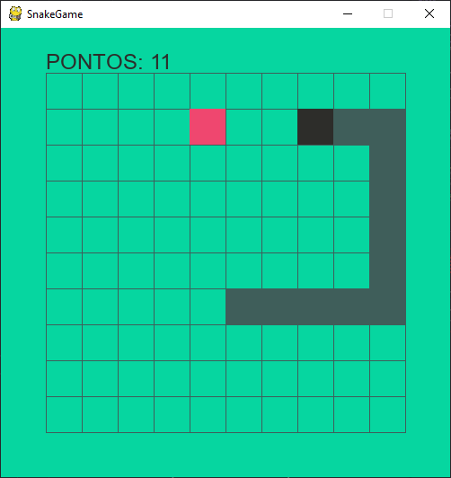

# Python Snake Game
[]()
[](http://opensource.org/licenses/MIT)
[](https://www.python.org/)
[](https://code.visualstudio.com/)

## Table of content

- [Description](#description)
- [Screenshot](#screenshot)
- [Getting started](#getting-started)
  - [Notes](#notes)
- [Licence](#licence)
- [Contact](#contact)

## Description
Implementation of a simple arcade style __snake game__ with `pygame`.

## Screenshot


## Getting started
To get a local copy up and running follow these simple steps.

### Instalation
1. Clone this repository
```sh
$ git clone https://github.com/vauxgomes/python-snakegame.git
```

2. Install required libraries
```sh
# PyGame
$ python -m pip install -U pygame
```

### Main configuration
```py
# Screen
WIDTH = 500
HEIGHT = 500

# Grid
BORDER = 50
ROWS = 10
BLOCK = (WIDTH - 2*BORDER)//ROWS
```

### Notes
 - This code is written in English with Portuguese-br comments

## License
Distributed under the MIT License. See LICENSE for more information

## Contact
[](https://www.linkedin.com/in/vauxgomes/)
[](https://twitter.com/vauxsandino)